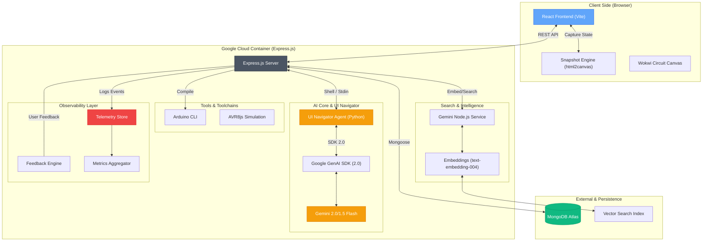

# System Architecture - SimuIDE Web (UI Navigator)

SimuIDE Web is a high-performance IDE and electronic simulator featuring the **UI Navigator**, a multimodal AI agent built on Gemini 2.0/1.5 Flash. The system is designed for massive scalability on Google Cloud Run.

### Core Architectural Pillars

1.  **UI Navigator (Multimodal Agent)**: Instead of basic API-chained logic, the agent "observes" the UI via snapshots. It uses Gemini 2.0 Flash to reason about the visual circuit state and outputs structured actions (`PLACE_COMPONENT`, `ADD_WIRE`, etc.) delivered via the Google GenAI SDK.
2.  **Vector Search (Semantic Discovery)**: Powered by MongoDB Atlas Vector Search and `text-embedding-004`, the system allows users to search the circuit database semantically (e.g., "find circuits with three LEDs in parallel").
3.  **Observability & Telemetry**: Every AI interaction is hashed, logged, and analyzed. A dedicated telemetry store tracks latency, token usage, and successful action execution.
4.  **Unified Deployment**: The entire stack—Node.js backend, Python agent, and Arduino toolchain—is co-located within a single optimized Docker image for rapid scaling on Google Cloud Run.
